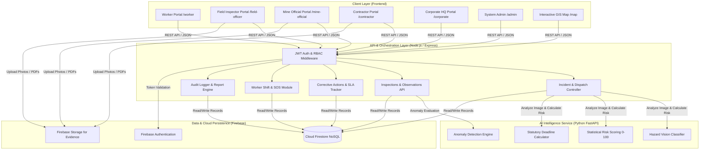

<div align="center">

# ⛏️ MineRakshak AI
### **Next-Generation Smart Governance, AI Hazard Vision & DGMS Statutory Compliance Platform for Coal Mines**

[](https://nextjs.org/)
[](https://reactjs.org/)
[](https://nodejs.org/)
[](https://fastapi.tiangolo.com/)
[](https://firebase.google.com/)
[](https://tailwindcss.com/)
[](https://dgms.gov.in/)

<br />

**MineRakshak AI** is an enterprise safety intelligence and statutory governance platform purpose-built for opencast and underground coal mining operations. Engineered in strict alignment with the **Directorate General of Mines Safety (DGMS)**, the **Mines Act (1952)**, and the **Coal Mines Regulations (CMR, 2017)**, the platform replaces archaic paper logbooks with automated computer vision hazard detection, real-time multi-party remediation dispatch, geospatial pit telemetry, and immutable audit logs.

[Explore Features](#-core-capabilities) • [Architecture](#-system-architecture) • [User Portals](#-role-based-access-control-rbac) • [Quick Start](#-quick-start--installation) • [Demo Credentials](#-demo-accounts--testing) • [API Reference](#-api-endpoints)

</div>

---

## 📌 Table of Contents

- [Executive Summary](#-executive-summary)
- [The Problem vs. The MineRakshak Solution](#-the-problem-vs-the-minerakshak-solution)
- [Core Capabilities](#-core-capabilities)
- [System Architecture](#-system-architecture)
- [End-to-End Incident Remediation Workflow](#-end-to-end-incident-remediation-workflow)
- [Role-Based Access Control (RBAC) & Portals](#-role-based-access-control-rbac--portals)
- [Technology Stack](#-technology-stack)
- [Project Directory Structure](#-project-directory-structure)
- [Quick Start & Installation](#-quick-start--installation)
- [Demo Accounts & Testing](#-demo-accounts--testing)
- [Core API Endpoints](#-core-api-endpoints)
- [Statutory Compliance Alignment](#-statutory-compliance-alignment)
- [Docker Deployment](#-docker-deployment)
- [Contributing & License](#-contributing--license)

---

## 📖 Executive Summary

In heavy industrial coal mining, statutory safety compliance is both a legal mandate and a critical operational imperative. Fatalities, slope failures, machinery entrapment, and toxic dust accumulations often stem from **communication delays** between on-ground inspectors, pit managers, and external maintenance contractors.

**MineRakshak AI bridges this gap through an autonomous safety lifecycle:**
1. **AI Computer Vision**: Detects hazards from on-site photos, assesses risk severity, and computes an explainable **AI Risk Index (0–100)**.
2. **Dynamic Statutory Deadlines**: Automatically calculates remediation deadlines based on DGMS severity standards (24h for Critical, 48h for High, 5–7 days for Medium).
3. **Instant 1-Click Multi-Party Dispatch**: Automatically routes actionable work orders to external repair contractors, schedules ground audits for field inspectors, and notifies corporate executives.
4. **Verification & Statutory Sign-Off**: Contractors upload cryptographic/photographic proof of repair; Mine Officials verify physical compliance before statutory sign-off.
5. **Tamper-Proof Audit Logging**: Every incident, inspection, edit, and closure is permanently stamped into an immutable audit trail.

---

## ⚡ The Problem vs. The MineRakshak Solution

| Traditional Mine Safety Operations | MineRakshak AI Governance Platform |
| :--- | :--- |
| 📋 **Manual Paper Logbooks**: Observations take 3–7 days to get transcribed and routed. | ⚡ **Instant AI Detection**: Hazard identification, severity scoring, and dispatch in < 30 seconds. |
| ⏳ **Unenforced Deadlines**: Corrective actions slip past DGMS statutory remediation windows. | ⏱️ **Auto-SLA Deadlines**: Dynamic countdown clocks with automated overdue escalation alerts. |
| 🔀 **Siloed Contractor Communication**: Contractors lack visibility into risk priority and exact defect specs. | 🛠️ **Dedicated Contractor Portal**: Dedicated portal with actionable fix checklists, risk score telemetry, and proof submission. |
| 📊 **Disconnected Mine Telemetry**: Corporate HQ reviews outdated monthly safety digests. | 📈 **Real-Time Fleet Benchmarking**: Real-time cross-pit hazard heatmaps, compliance indices, and 1-click CSV exports. |
| ⚠️ **Unverified Rectifications**: Maintenance work closed without visual verification. | 📸 **Multi-Party Verification Loop**: Mandatory photo proof submission followed by official sign-off. |

---

## 🚀 Core Capabilities

### 🔍 1. AI Hazard Vision & Computer Vision Engine
- **Multimodal Defect Classification**: Identifies structural bench fractures, missing conveyor pull-cords/guards, haul road berm erosion, heavy machinery (HEMM) leaks, and dust suppression failures.
- **Explainable AI Risk Index (0–100)**: Multi-factor statistical scoring integrating historical mine violations, zone severity weightings, and defect urgency.
- **Contextual Recommendation Engine**: Generates DGMS-compliant standard operating procedures (SOPs) and remediation instructions for immediate field implementation.

### ⏱️ 2. Automated Statutory Remediation Deadlines
- Dynamically assigns strict statutory remediation timeframes in accordance with DGMS guidelines:
  - 🔴 **Critical Severity**: 24-Hour Mandatory Lockout & Repair Window
  - 🟠 **High Severity**: 48-Hour Rectification SLA
  - 🟡 **Medium Severity**: 5 to 7 Days Remediation Period
  - 🟢 **Low Severity**: Scheduled Routine Maintenance

### 🌐 3. Interactive GIS Geospatial Coal Field Map
- **Leaflet & OpenStreetMap Engine**: Interactive map plotting operational coal pits across India (Kusmunda, Gevra, Jharia, Singrauli, Dipka, Umrer, etc.).
- **Zone-Level Hazard Heatmaps**: Color-coded risk clusters, active hazard markers, pit coordinates, and direct links to open inspection tickets.

### 👷 4. Frontline Worker Safety & SOS Dispatch
- **Daily GPS Attendance & Shift Check-In**: Geofenced shift logging for underground and opencast miners.
- **PPE Self-Verification Checklist**: Mandatory pre-shift digital verification (Helmet, Boots, Dust Mask, Reflective Jacket, Cap Lamp).
- **1-Tap Emergency SOS Alert**: Instant panic broadcast dispatching live coordinates and pit alerts to all officials and safety teams.

### 📜 5. Statutory Document Vault & AI OCR
- Centralized storage for DGMS safety circulars, Form IV workman logs, HEMM brake retardation test certificates, and air quality audits.
- Automated OCR text extraction for instant keyword search and regulatory audit readiness.

### 🔒 6. Immutable DGMS Audit Trail & Governance Export
- Append-only event store recording actor ID, role, action, timestamp, old values, and new values.
- One-click executive report generation for board presentations and statutory DGMS inspection audits (.csv / PDF summaries).

---

## 🏗️ System Architecture



---

## 🔄 End-to-End Incident Remediation Workflow

```
┌────────────────────────────────────────────────────────────────────────┐
│ 1. HAZARD DISCOVERY & AI CAPTURE                                       │
│    • Mine Official or Inspector snaps a photo of an on-site defect     │
│    • AI analyzes image: identifies defect, computes 0-100 risk score,  │
│      and calculates statutory remediation deadline (e.g. 24h)          │
└───────────────────────────────────┬────────────────────────────────────┘
                                    │
                                    ▼
┌────────────────────────────────────────────────────────────────────────┐
│ 2. ONE-CLICK MULTI-PARTY DISPATCH                                      │
│    • Contractor: Receives work order + deadline countdown clock        │
│    • Field Officer: Receives on-ground verification task               │
│    • Corporate HQ: Real-time notification & risk index update          │
│    • Audit Log: Immutable event record created                         │
└───────────────────────────────────┬────────────────────────────────────┘
                                    │
                                    ▼
┌────────────────────────────────────────────────────────────────────────┐
│ 3. CONTRACTOR REPAIR & PROOF SUBMISSION                                │
│    • Contractor executes physical remediation on site                  │
│    • Uploads completion notes and photo proof of fix via portal        │
│    • Action status advances to "Resolved - Awaiting Sign-Off"          │
└───────────────────────────────────┬────────────────────────────────────┘
                                    │
                                    ▼
┌────────────────────────────────────────────────────────────────────────┐
│ 4. STATUTORY VERIFICATION & CLOSURE                                    │
│    • Mine Official / Inspector reviews evidence and verifies fix       │
│    • Official signs off: Action marked "Closed & Verified"             │
│    • Pit Risk Index recalculated; full DGMS audit record updated       │
└────────────────────────────────────────────────────────────────────────┘
```

---

## 👥 Role-Based Access Control (RBAC) & Portals

MineRakshak AI features **6 segregated operational personas**, each with dedicated permissions, navigation menus, and workflows:

| Role | Target Persona | Primary Responsibilities & Capabilities | Accessible Route |
| :--- | :--- | :--- | :--- |
| 👷 **Worker / Miner** | Pit Miner / Machine Operator | GPS attendance check-in, daily 5-point PPE confirmation, hazard reporting, instant Emergency SOS broadcast. | `/worker` |
| 🔍 **Field Officer** | Ground Safety Inspector | Scheduled statutory audits, digital observations, multi-evidence proof uploads (photos/PDFs), corrective action verification. | `/field-officer` |
| 👨‍💼 **Mine Official** | Mine Agent / Pit Manager | AI Hazard Vision capture, automated multi-party dispatch, inspection review, and final statutory sign-off. | `/mine-official` |
| 🛠️ **Contractor Company** | Repair & Maintenance Vendor | Dedicated portal with assigned work orders, AI risk metrics, statutory deadline countdown timers, and photo proof upload. | `/contractor` |
| 🏢 **Corporate Management** | Mining Subsidiary HQ | Fleet-wide risk benchmarking, cross-pit comparative telemetry, contractor SLA tracking, and 1-click executive compliance export. | `/corporate` |
| ⚙️ **System Administrator** | IT & Safety Governance Officer | User credentials and RBAC management, mine facility registry, system health monitoring, and immutable audit logs. | `/admin` |

---

## 💻 Technology Stack

### Frontend Application
- **Framework**: [Next.js 14](https://nextjs.org/) (App Router, Server & Client Components) & [React 18](https://reactjs.org/)
- **Styling**: [Tailwind CSS 3.4](https://tailwindcss.com/) with custom coal-industrial dark design tokens
- **Icons & UI**: [Lucide React](https://lucide.dev/)
- **Geospatial Maps**: [Leaflet](https://leafletjs.com/) & [React-Leaflet](https://react-leaflet.js.org/)
- **Authentication**: Firebase Auth Client SDK with custom claims & local session persistence

### Backend REST API
- **Runtime**: [Node.js 18+](https://nodejs.org/) & [Express 4](https://expressjs.com/)
- **Database & Storage**: [Firebase Admin SDK](https://firebase.google.com/docs/admin/setup) (Cloud Firestore & Firebase Storage) with zero-config in-memory fallback
- **Logging & Security**: Morgan HTTP logger, CORS middleware, JWT token verification, granular RBAC filters
- **File Uploads**: Multer multipart handler for multi-evidence attachments

### AI Microservice
- **Framework**: [Python 3.10+](https://python.org/) & [FastAPI](https://fastapi.tiangolo.com/) with [Uvicorn](https://www.uvicorn.org/)
- **Computer Vision & Hazard Intelligence**: Multimodal image classification, defect pattern matching, and rule-based risk inference
- **Risk Algorithms**: Multi-factor statistical scoring, anomaly detection, and statutory deadline calculation

---

## 📁 Project Directory Structure

```
MineRakshak-AI/
├── ai-service/                   # Python FastAPI AI Microservice
│   ├── app/
│   │   ├── image_analysis.py     # Computer vision hazard classifier & deadline calculator
│   │   ├── risk_scoring.py       # Multi-factor mine risk calculation (0-100)
│   │   ├── anomaly_detection.py  # Statistical anomaly detection algorithms
│   │   ├── prioritization.py     # Inspection prioritization engine
│   │   ├── firebase_client.py    # Python Firestore client bridge
│   │   └── main.py               # FastAPI application & REST routing
│   └── requirements.txt          # Python dependencies (fastapi, uvicorn, pydantic)
│
├── backend/                      # Node.js Express REST API
│   ├── src/
│   │   ├── config/               # Firebase Admin & environment configuration
│   │   ├── middleware/           # JWT auth, role validation & error handlers
│   │   ├── modules/              # Domain-driven modular route controllers:
│   │   │   ├── auditLogs/        # Append-only tamper-proof audit trail
│   │   │   ├── auth/             # Login, profile, and demo auth switch
│   │   │   ├── compliance/       # DGMS statutory requirements checklist
│   │   │   ├── correctiveActions/# Work orders, SLA deadlines, proof upload
│   │   │   ├── dashboard/        # Role-specific dashboard aggregators
│   │   │   ├── documents/        # Statutory document repository & OCR
│   │   │   ├── incidents/        # AI hazard vision & multi-party dispatch
│   │   │   ├── inspections/      # Digital audit checklists & observations
│   │   │   ├── mines/            # Coal pit facilities & geolocation registry
│   │   │   ├── notifications/    # In-app alert notifications & triggers
│   │   │   ├── reports/          # Statutory compliance exports (.csv)
│   │   │   ├── users/            # RBAC user profile management
│   │   │   ├── violations/       # Identified safety violations
│   │   │   └── worker/           # GPS shift check-in, PPE checks, SOS alerts
│   │   ├── scripts/
│   │   │   ├── seed.js           # Comprehensive Indian coal mining seed dataset
│   │   │   └── test_features.js  # Feature validation & test runner
│   │   └── app.js                # Express app initialization & server listener
│   └── package.json
│
├── frontend/                     # Next.js 14 / React 18 Web Application
│   ├── app/
│   │   ├── admin/                # System Administrator Portal
│   │   ├── audit-trail/          # Immutable Audit Trail Viewer
│   │   ├── compliance/           # DGMS Statutory Compliance Manager
│   │   ├── contractor/           # Contractor Work Order & Repair Portal
│   │   ├── corporate/            # Corporate HQ Multi-Mine Governance Portal
│   │   ├── corrective-actions/   # Action Remediation Kanban & Table
│   │   ├── documents/            # Document Vault & AI OCR Search
│   │   ├── field-officer/        # Field Safety Inspector Portal
│   │   ├── login/                # 6-Role Fast Demo Login Portal
│   │   ├── map/                  # Leaflet Interactive GIS Mine Map
│   │   ├── mine-official/        # Mine Official Portal & AI Vision Modal
│   │   ├── reports/              # Statutory Reports & Data Export Center
│   │   ├── worker/               # Frontline Worker Shift, PPE & SOS Portal
│   │   ├── layout.jsx            # Root HTML shell & metadata
│   │   └── page.jsx              # Landing Page & Solution Overview
│   ├── src/
│   │   ├── components/           # AppShell, AI Incident Modal, Status Badges, Maps
│   │   ├── context/              # AuthContext (5-role inference, token handling)
│   │   └── services/             # API clients (incidents, worker, admin, corporate)
│   └── package.json
│
├── docs/                         # Technical specifications & Firestore schema
│   └── DATA_MODEL.md             # Complete NoSQL collection architecture
├── docker-compose.yml            # Multi-container full-stack deployment
├── start.bat                     # 1-Click launcher for Windows Command Prompt
├── start.ps1                     # 1-Click launcher for Windows PowerShell
└── package.json                  # Root orchestrator (concurrently launcher)
```

---

## 🛠️ Quick Start & Installation

### 1. Prerequisites
Ensure you have the following installed on your machine:
- **Node.js**: v18.0.0 or higher ([Download Node.js](https://nodejs.org/))
- **Python**: v3.10 or higher ([Download Python](https://www.python.org/))
- **Git**: ([Download Git](https://git-scm.com/))

### 2. Clone the Repository
```bash
git clone https://github.com/omrahatal14-sketch/MineRakshak-AI.git
cd MineRakshak-AI
```

### 3. Install All Dependencies
You can install dependencies for all 3 sub-projects in a single step:
```bash
# 1. Install root orchestrator packages
npm install

# 2. Install backend dependencies
cd backend && npm install && cd ..

# 3. Install frontend dependencies
cd frontend && npm install && cd ..

# 4. Install AI service dependencies
cd ai-service && pip install -r requirements.txt && cd ..
```

*(Or simply run `npm run install:all`)*

### 4. Configure Environment Variables
Create a `.env` file in the root directory (or use default development fallbacks):
```ini
# Backend API Configuration
PORT=4000
NODE_ENV=development
CORS_ORIGIN=http://localhost:3000

# AI Microservice URL
AI_SERVICE_URL=http://localhost:8000

# Frontend Next.js Configuration
NEXT_PUBLIC_API_BASE_URL=http://localhost:4000/api
NEXT_PUBLIC_AI_SERVICE_URL=http://localhost:8000

# Firebase Configuration (Optional - platform includes resilient zero-config fallback)
FIREBASE_PROJECT_ID=your_firebase_project_id
NEXT_PUBLIC_FIREBASE_API_KEY=your_firebase_api_key
NEXT_PUBLIC_FIREBASE_AUTH_DOMAIN=your_project.firebaseapp.com
NEXT_PUBLIC_FIREBASE_PROJECT_ID=your_firebase_project_id
NEXT_PUBLIC_FIREBASE_STORAGE_BUCKET=your_project.firebasestorage.app
NEXT_PUBLIC_FIREBASE_MESSAGING_SENDER_ID=your_sender_id
NEXT_PUBLIC_FIREBASE_APP_ID=your_app_id
```

### 5. Launch Application
Start all 3 services concurrently (Backend on `4000`, Frontend on `3000`, AI Service on `8000`):

```bash
npm run dev
```

> **Windows Users**: You can also double-click `start.bat` or run `powershell -ExecutionPolicy Bypass -File start.ps1` to launch all services instantly.

Once running, access the portals at:
- **Frontend Web Portal**: [http://localhost:3000](http://localhost:3000)
- **Backend REST API**: [http://localhost:4000/api/health](http://localhost:4000/api/health)
- **AI Microservice Docs**: [http://localhost:8000/docs](http://localhost:8000/docs)

---

## 🔑 Demo Accounts & Testing

MineRakshak AI features a **1-Click Quick Demo Login Switcher** on the login page (`/login`). All pre-seeded accounts share the default password: `MineRakshak@123`.

| Persona | Demo Email | Role Key | What to Test in this Dashboard |
| :--- | :--- | :--- | :--- |
| 👷 **Worker / Miner** | `worker@minerakshak.gov.in` | `worker` | GPS Shift Attendance check-in, 5-point PPE verification, Hazard photo submission, 1-tap SOS trigger. |
| 🔍 **Field Officer** | `field.officer@minerakshak.gov.in` | `field_officer` | Digital audit inspections, multi-evidence uploads, verifying contractor repairs on-site. |
| 👨‍💼 **Mine Official** | `mine.official@minerakshak.gov.in` | `mine_official` | **AI Hazard Vision Scanner**, auto statutory deadline calculation, 1-click multi-party dispatch, sign-off. |
| 🛠️ **Contractor Company** | `contractor@minerakshak.gov.in` | `contractor` | Viewing assigned work orders, statutory SLA countdowns, submitting repair notes & photo proof. |
| 🏢 **Corporate HQ** | `corporate@minerakshak.gov.in` | `corporate` | Multi-mine safety benchmarking, comparative risk charts, contractor SLA tracking, 1-click CSV report export. |
| ⚙️ **System Admin** | `admin@minerakshak.gov.in` | `admin` | User & RBAC management, mine facility registry, streaming immutable audit logs. |

---

## 📡 Core API Endpoints

### 🧠 AI Vision & Hazard Intelligence
- `POST /api/incidents/ai-analyze` — Upload hazard photo to compute defect category, risk score (0–100), and statutory deadline.
- `POST /api/incidents/dispatch` — 1-click multi-party dispatch to contractor, inspector, and corporate HQ.
- `POST /risk-score` *(AI Service :8000)* — Multi-factor statistical pit risk scoring.
- `POST /anomaly-detection` *(AI Service :8000)* — Anomaly detection across mine sensor and observation telemetry.

### 📋 Statutory Inspections & Observations
- `GET /api/inspections` — Retrieve statutory audits (filtered by role, pit, and status).
- `POST /api/inspections` — Schedule a new DGMS compliance inspection.
- `PUT /api/inspections/:id/submit` — Submit completed field observations with multi-evidence attachments.
- `PUT /api/inspections/:id/review` — Mine official review and statutory sign-off.

### 🛠️ Corrective Actions & Contractor Portal
- `GET /api/corrective-actions` — List work orders with priority, deadlines, and assigned companies.
- `PUT /api/corrective-actions/:id/resolve` — Submit rectification notes and photo proof of fix (Contractor).
- `PUT /api/corrective-actions/:id/verify` — Physical verification and final closure (Mine Official / Inspector).

### 👷 Frontline Worker Safety & SOS
- `GET /api/worker/status` — Get today's shift attendance and PPE verification status.
- `POST /api/worker/attendance` — Log GPS geofenced shift check-in.
- `POST /api/worker/ppe-check` — Submit daily 5-point PPE compliance confirmation.
- `POST /api/worker/sos` — Trigger emergency panic SOS broadcast to pit officials.

### 📊 Corporate Governance & Audit
- `GET /api/dashboard/corporate` — Multi-mine safety benchmarks, contractor compliance rates, and open risks.
- `GET /api/reports/summary` — Statutory compliance summary data for export.
- `GET /api/audit-logs` — Immutable event stream of all system actions.

---

## ⚖️ Statutory Compliance Alignment

MineRakshak AI is built to conform with statutory standards mandated by Indian and global mining authorities:

- **Mines Act, 1952**: Statutory provisions regarding health, safety, and welfare of mining personnel.
- **Coal Mines Regulations (CMR), 2017**:
  - *Regulation 178*: Haul road gradient limits (max 1 in 16) and mandatory 1.5m rock berm specifications.
  - *Regulation 184*: Protective fencing, interlocks, and guards on mechanical conveyor drives and rotating equipment.
  - *Regulation 130*: Geotechnical slope stability and highwall tension crack displacement monitoring.
- **DGMS Circulars**: Standard operating procedures for HEMM pre-shift inspections, brake retardation tests, and wet dust suppression systems.
- **CPCB Ambient Air Standards**: Gravimetric respirable particulate monitoring (PM10 < 3.0 mg/m³ at coal handling plants).

---

## 🐳 Docker Deployment

To launch the complete application stack (Backend, Frontend, and AI Service) in isolated Docker containers:

```bash
# Build and run containers
docker-compose up --build

# Run in background detached mode
docker-compose up -d

# Stop containers
docker-compose down
```

---

## 🤝 Contributing

Contributions, issues, and feature requests are welcome!
1. Fork the repository
2. Create your feature branch (`git checkout -b feature/AmazingFeature`)
3. Commit your changes (`git commit -m 'Add some AmazingFeature'`)
4. Push to the branch (`git push origin feature/AmazingFeature`)
5. Open a Pull Request

---

## 📄 License

This project is licensed for educational, industrial compliance, and safety governance research in coal mining operations.

<div align="center">
  <sub>Built with ❤️ for zero-harm coal mining operations & worker safety.</sub>
</div>
